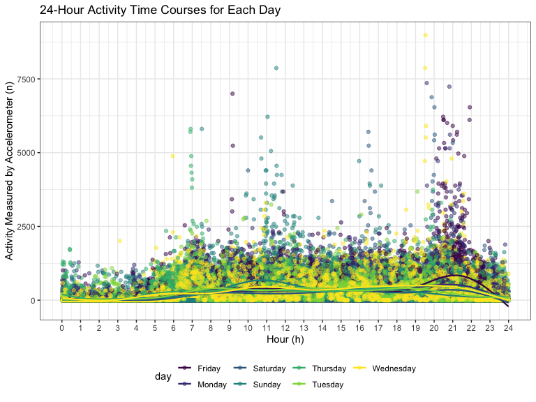

p8105_hw3_bh2849
================
Binyue Hu
2022-10-13

### Problem 1

#### Read in the data

``` r
data("instacart")

instacart = 
  instacart %>% 
  as_tibble(instacart)
```

#### Answer questions about the data

This dataset contains 1384617 rows and 15 columns, with each row
resprenting a single product from an instacart order. Variables include
identifiers for user, order, and product; the order in which each
product was added to the cart. There are several order-level variables,
describing the day and time of the order, and number of days since prior
order. Then there are several item-specific variables, describing the
product name (e.g. Yogurt, Avocado), department (e.g. dairy and eggs,
produce), and aisle (e.g. yogurt, fresh fruits), and whether the item
has been ordered by this user in the past. In total, there are 39123
products found in 131209 orders from 131209 distinct users.

Below is a table summarizing the number of items ordered from aisle. In
total, there are 134 aisles, with fresh vegetables and fresh fruits
holding the most items ordered by far.

``` r
instacart %>% 
  count(aisle) %>% 
  arrange(desc(n))
```

    ## # A tibble: 134 × 2
    ##    aisle                              n
    ##    <chr>                          <int>
    ##  1 fresh vegetables              150609
    ##  2 fresh fruits                  150473
    ##  3 packaged vegetables fruits     78493
    ##  4 yogurt                         55240
    ##  5 packaged cheese                41699
    ##  6 water seltzer sparkling water  36617
    ##  7 milk                           32644
    ##  8 chips pretzels                 31269
    ##  9 soy lactosefree                26240
    ## 10 bread                          23635
    ## # … with 124 more rows

Next is a plot that shows the number of items ordered in each aisle.
Here, aisles are ordered by ascending number of items.

``` r
instacart %>% 
  count(aisle) %>% 
  filter(n > 10000) %>% 
  mutate(aisle = fct_reorder(aisle, n)) %>% 
  ggplot(aes(x = aisle, y = n)) + 
  geom_point() + 
  labs(title = "Number of items ordered in each aisle") +
  theme(axis.text.x = element_text(angle = 60, hjust = 1))
```


Our next table shows the three most popular items in aisles
`baking ingredients`, `dog food care`, and `packaged vegetables fruits`,
and includes the number of times each item is ordered in your table.

``` r
instacart %>% 
  filter(aisle %in% c("baking ingredients", "dog food care", "packaged vegetables fruits")) %>%
  group_by(aisle) %>% 
  count(product_name) %>% 
  mutate(rank = min_rank(desc(n))) %>% 
  filter(rank < 4) %>% 
  arrange(desc(n)) %>%
  knitr::kable()
```

| aisle                      | product_name                                  |    n | rank |
|:---------------------------|:----------------------------------------------|-----:|-----:|
| packaged vegetables fruits | Organic Baby Spinach                          | 9784 |    1 |
| packaged vegetables fruits | Organic Raspberries                           | 5546 |    2 |
| packaged vegetables fruits | Organic Blueberries                           | 4966 |    3 |
| baking ingredients         | Light Brown Sugar                             |  499 |    1 |
| baking ingredients         | Pure Baking Soda                              |  387 |    2 |
| baking ingredients         | Cane Sugar                                    |  336 |    3 |
| dog food care              | Snack Sticks Chicken & Rice Recipe Dog Treats |   30 |    1 |
| dog food care              | Organix Chicken & Brown Rice Recipe           |   28 |    2 |
| dog food care              | Small Dog Biscuits                            |   26 |    3 |

Finally is a table showing the mean hour of the day at which Pink Lady
Apples and Coffee Ice Cream are ordered on each day of the week. This
table has been formatted in an untidy manner for human readers. Pink
Lady Apples are generally purchased slightly earlier in the day than
Coffee Ice Cream, with the exception of day 5.

``` r
instacart %>%
  filter(product_name %in% c("Pink Lady Apples", "Coffee Ice Cream")) %>%
  group_by(product_name, order_dow) %>%
  summarize(mean_hour = mean(order_hour_of_day)) %>%
  spread(key = order_dow, value = mean_hour) %>%
  knitr::kable(digits = 2)
```

    ## `summarise()` has grouped output by 'product_name'. You can override using the
    ## `.groups` argument.

| product_name     |     0 |     1 |     2 |     3 |     4 |     5 |     6 |
|:-----------------|------:|------:|------:|------:|------:|------:|------:|
| Coffee Ice Cream | 13.77 | 14.32 | 15.38 | 15.32 | 15.22 | 12.26 | 13.83 |
| Pink Lady Apples | 13.44 | 11.36 | 11.70 | 14.25 | 11.55 | 12.78 | 11.94 |

## Problem 2

#### Load, tidy and describe the data

``` r
accel_data = read_csv("./data/accel_data.csv") %>%
  janitor::clean_names() %>%
  pivot_longer(activity_1:activity_1440,
               names_prefix = "activity_",
               names_to = "minute",
               values_to = "activity_counts") %>%
  mutate(minute = as.numeric(minute),
         day_type = case_when(day %in% c("Saturday","Sunday") ~ "Weekend",
                                TRUE ~ "Weekday"))
```

    ## Rows: 35 Columns: 1443
    ## ── Column specification ────────────────────────────────────────────────────────
    ## Delimiter: ","
    ## chr    (1): day
    ## dbl (1442): week, day_id, activity.1, activity.2, activity.3, activity.4, ac...
    ## 
    ## ℹ Use `spec()` to retrieve the full column specification for this data.
    ## ℹ Specify the column types or set `show_col_types = FALSE` to quiet this message.

``` r
accel_data
```

    ## # A tibble: 50,400 × 6
    ##     week day_id day    minute activity_counts day_type
    ##    <dbl>  <dbl> <chr>   <dbl>           <dbl> <chr>   
    ##  1     1      1 Friday      1            88.4 Weekday 
    ##  2     1      1 Friday      2            82.2 Weekday 
    ##  3     1      1 Friday      3            64.4 Weekday 
    ##  4     1      1 Friday      4            70.0 Weekday 
    ##  5     1      1 Friday      5            75.0 Weekday 
    ##  6     1      1 Friday      6            66.3 Weekday 
    ##  7     1      1 Friday      7            53.8 Weekday 
    ##  8     1      1 Friday      8            47.8 Weekday 
    ##  9     1      1 Friday      9            55.5 Weekday 
    ## 10     1      1 Friday     10            43.0 Weekday 
    ## # … with 50,390 more rows

In the tidied dataset, there are 50400 observations, and each row
represents a single minute of accelerometer data for a 63 year-old male
over the course of five weeks.

There are 6 variables in this dataset include week, day_id, day, minute,
activity_counts, day_type.

#### Traditional Analysis of the Data

``` r
Tradi_analysis = accel_data %>%
  group_by(week,day) %>%
  dplyr::summarise(total_activity = sum(activity_counts)) %>%
  pivot_wider(names_from = day,
              values_from = total_activity) %>%
  select("Monday", "Tuesday", "Wednesday", "Thursday", "Friday", "Saturday", "Sunday") %>%
  knitr::kable(digits = 1)
```

    ## `summarise()` has grouped output by 'week'. You can override using the
    ## `.groups` argument.
    ## Adding missing grouping variables: `week`

``` r
Tradi_analysis
```

| week |   Monday |  Tuesday | Wednesday | Thursday |   Friday | Saturday | Sunday |
|-----:|---------:|---------:|----------:|---------:|---------:|---------:|-------:|
|    1 |  78828.1 | 307094.2 |    340115 | 355923.6 | 480542.6 |   376254 | 631105 |
|    2 | 295431.0 | 423245.0 |    440962 | 474048.0 | 568839.0 |   607175 | 422018 |
|    3 | 685910.0 | 381507.0 |    468869 | 371230.0 | 467420.0 |   382928 | 467052 |
|    4 | 409450.0 | 319568.0 |    434460 | 340291.0 | 154049.0 |     1440 | 260617 |
|    5 | 389080.0 | 367824.0 |    445366 | 549658.0 | 620860.0 |     1440 | 138421 |

There are not obvious trends in the table, because numbers are
erratically distributed in the table and fluctuate between large and
small.

#### Single-Panel Plot

``` r
accel_data %>%
  ggplot(aes(x = minute/60, y = activity_counts, color = day)) + 
  geom_point(alpha = .5) +
  geom_smooth(se = F, size = 0.8, alpha = 0.8) +
  labs(title = "24-Hour Activity Time Courses for Each Day",
       x = "Hour (h)",
       y = "Activity Measured by Accelerometer (n)") +
  scale_x_continuous(
    breaks = c(0,1,2,3,4,5,6,7,8,9,10,11,12,13,14,15,16,17,18,19,20,21,22,23,24)) +
  theme_bw() +
  theme(legend.position = "bottom")
```

    ## `geom_smooth()` using method = 'gam' and formula 'y ~ s(x, bs = "cs")'



The plot shows that the person’s activity level increases from midnight
to about 10am everyday. After 10am, the activity level declines and goes
flat until 7pm. The person’s activity level mostly peaks at 9pm, and it
gradually decreases to 0 in the midnight.

## Problem 2
